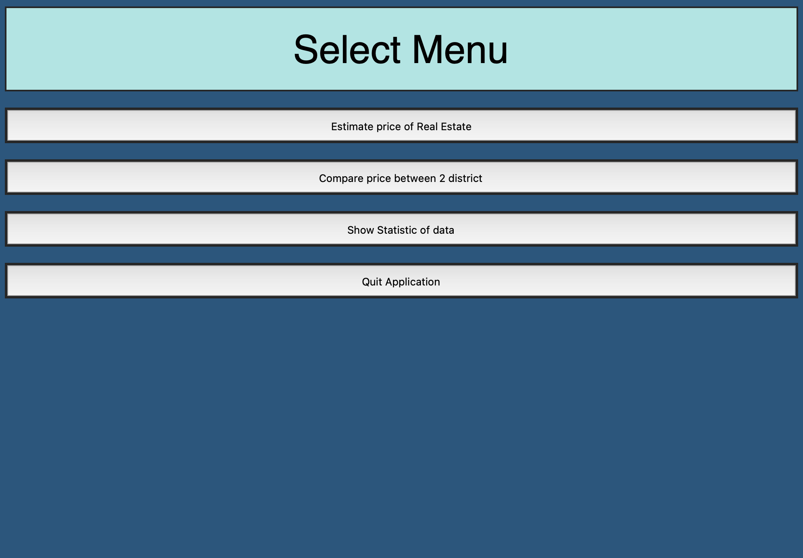
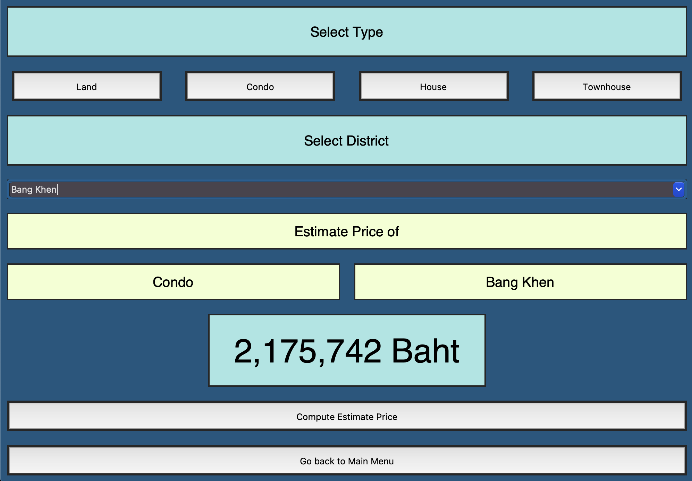
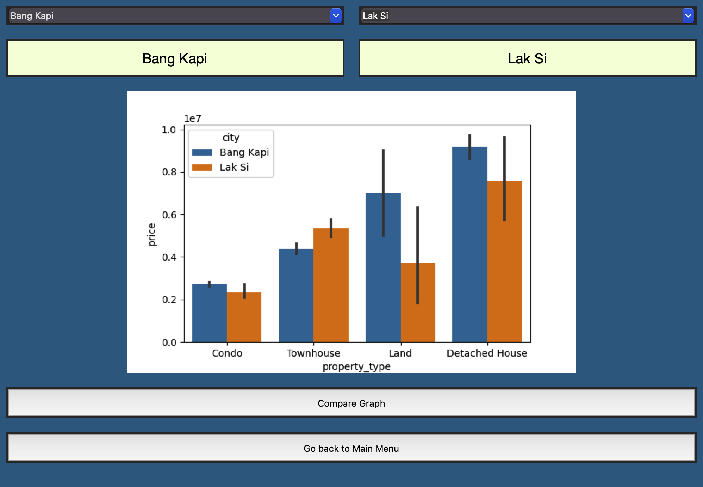
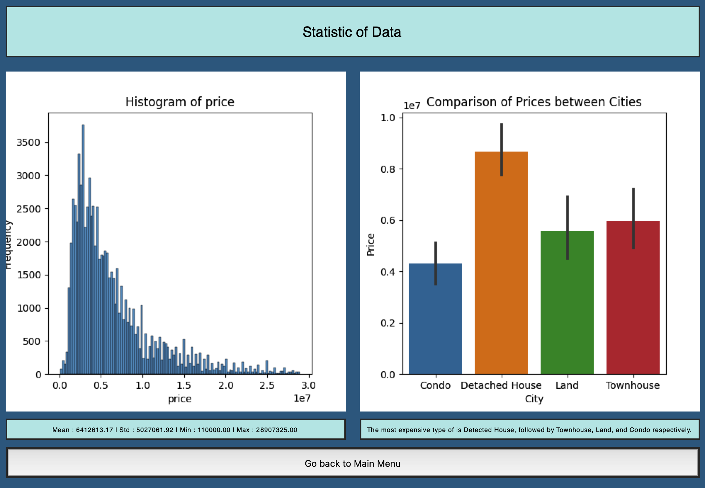
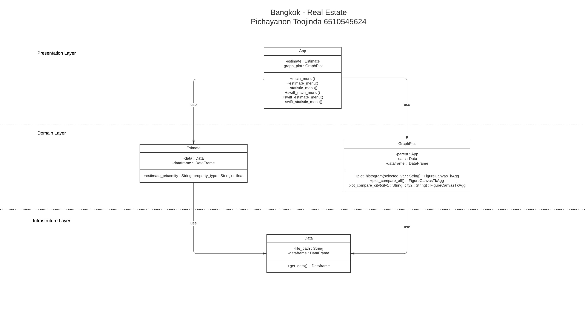
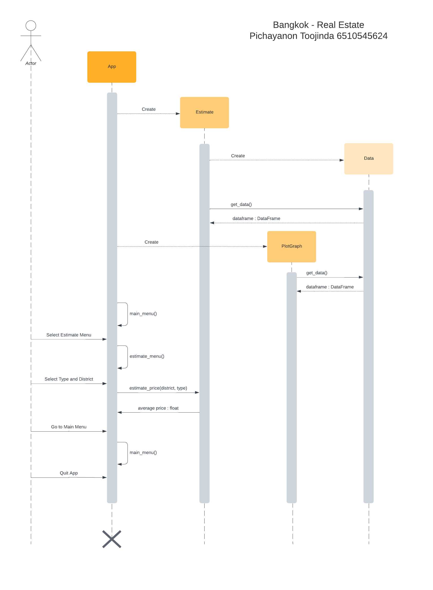

# Bangkok-RealEstate
 
## Description
Bangkok-RealEstate is a program that allows users to estimate real estate prices in different
districts in Bangkok and can also compare prices of 2 districts to help users 
choose the right real estate for themselves.
Main Menu

Estimate Menu

Compare Menu

Statistic Menu

## Data Sources
200k+ homes for sale in Thailand dataset from https://www.kaggle.com/datasets/polartech/200k-homes-for-sale-in-thailand.
This dataset includes a lof of real estate ( 220557 row ) and
housing attributes ( 69 column ) such as price, property_type, city, state, 
latitude, longitude, etc. In this program, 78550 row is used because 
it uses processed data.
 
## Code Structure
1. [App.py](App.py) : run program
2. [EstimatePrice.py](EstimatePrice.py) : contain class Estimate
3. [GraphPlot.py](GraphPlot.py) : contain class GraphPlot
4. [Data.py](Data.py) : contain class Data

## Running the Application
1. [tkinter](https://docs.python.org/3/library/tk.html) : Use for create GUI
2. [numpy](https://numpy.org) : Use for create nparray
3. [pandas](https://pandas.pydata.org) : Use for read file
4. [matplotlib](https://matplotlib.org) : Use for create graph
5. [seaborn](https://seaborn.pydata.org) : Use for create graph

 
## Design
UML class diagram

Sequence diagram

## Design Patterns Used
This program use facade pattern design. App class is a class that combines 
functions from class Estimate and GraphPlot and interaction with user.
 
## Graph Algorithm Used
Bangkok-RealEstate is a program that helps users find real estate in Bangkok 
that suits their budget. The feature that uses a graph algorithm is to find 
out the concentration of a real estate in the user's selected district. 
So that users can know whether this district is suitable for purchase or 
investment or not.
1. There is a vertex for real estate that is less than 200 meters adjacent to each other, otherwise it is not considered a vertex. Assume there are n real estate.
2. There is an undirected edge. Edge is a route connecting two  real estate that are less than 200 meters apart. Edge can't tell how far apart two real estate are. It was only said that the two were less than 200 meters apart.
3. We do not need to associate additional values with the vertices or edges
4. We need to find how much clutter does the district have.
5. We can solve this problem using ComponentCount 
( WhatEverFirstSearch )
6. The algorithm runs in O(V+E) = O(n+n^2) = O(n^2) time

